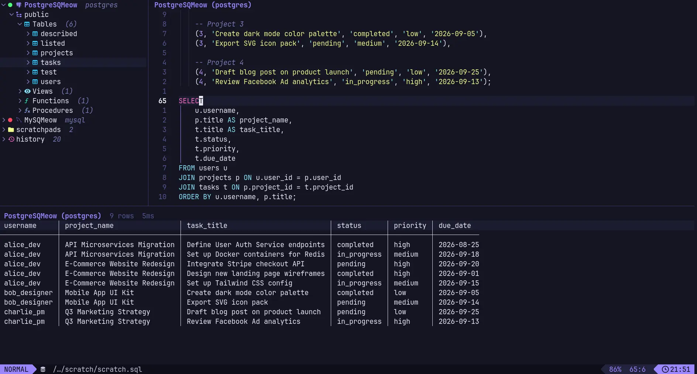

# 🐱 sqmeow.nvim

_sqmeow.nvim_ is a database client for Neovim: a Lua frontend over a Rust engine. Connect from a form instead of a connection string, browse the schema in a sidebar, run SQL from a scratchpad, and read the result in a grid the editor never had to render itself.


> Early development. SQLite, PostgreSQL and MySQL work end to end.

## ✨ Features

- 🖥️ One command opens the whole client: drawer, scratchpad and result grid.
- 📝 A connection dialog with real fields, so nobody types a URL by hand. The password shows as `***`.
- 💾 Connections are saved and listed with a dot beside each one: green when open, red when not.
- 🎯 One active connection, marked in the drawer, and a scratchpad that always runs on its own database.
- 🌲 Lazy schema browsing, so a database with ten thousand tables opens as fast as one with ten.
- 📄 Scratchpads that survive a restart, listed in the drawer, renameable and deletable in place.
- 🕘 A query log written to disk, so what you ran yesterday is still there today.
- ⚡ Rows are decoded in Rust and drawn with nui.nvim, a page at a time, so a large result never stalls the editor.
- 🐘 SQLite, PostgreSQL and MySQL, with schemas, views, functions and procedures.
- 🔐 Passwords that stay out of the config, expanded by the engine and never echoed back.
- ⌨️ No global keymaps. Every key is buffer-local, described, and yours to change.
- 🧩 One plugin dependency: nui.nvim, which draws the grid, the schema tree and the dialog.

## 🎬 Preview



## 🚀 Installation

Requires Neovim 0.10 or newer. No database client tools and no Rust toolchain, unless you ask to build the engine yourself. [nui.nvim](https://github.com/MunifTanjim/nui.nvim) is required: it draws the result grid, the schema tree and the connection dialog.

The engine is a separate binary and **nothing installs it on its own**. Call `install()` from your plugin manager's build hook, so it happens when you update the plugin rather than in the middle of a session.

With [lazy.nvim](https://github.com/folke/lazy.nvim):

```lua
{
  '2giosangmitom/sqmeow.nvim',
  dependencies = { 'MunifTanjim/nui.nvim' },
  version = '*', -- Use the latest release instead of the latest commit
  build = function()
    -- Works out how to install on its own. If that picks wrong, name a method:
    --    'curl', 'wget', 'powershell', 'cargo'
    require('sqmeow').install()
  end,
  opts = {},
}
```

Calling `setup` is optional; without it every option keeps its default. Calling `install` is not: without an engine, the first query tells you to run it.

### Running the latest commit

`install()` downloads a build of the matching release. To run an untagged commit there is no release to download, so build the checkout instead — this needs a Rust toolchain:

```lua
{
  '2giosangmitom/sqmeow.nvim',
  dependencies = { 'MunifTanjim/nui.nvim' },
  build = function()
    require('sqmeow').install('cargo')
  end,
  opts = {},
}
```

Either way the engine ends up in the same place, so switching between them replaces what you had rather than leaving two behind.

`:Sqmeow install [method]` does the same thing from inside a session, without waiting. `:checkhealth sqmeow` says which engine is running and where it came from.

## ⚡ Getting started

1. `:Sqmeow` opens the drawer on the left, a scratchpad beside it, and the result window along the
   bottom. Run it again to put your windows back exactly as they were.
2. `:Sqmeow add`, or `A` in the drawer, opens the dialog above. The name is the first thing it asks
   for and it suggests nothing. That name is what the drawer calls the database from now on, and
   the URL itself never appears.
3. `<CR>` on a red dot opens the connection. `<CR>` on a green one shows its schemas.
4. Type SQL in the scratchpad and press `<CR>`. The statement the cursor is in runs; a selection
   runs instead when there is one. A statement that fails becomes a diagnostic on its own lines
   rather than a message that scrolls away.

A connection holds schemas, a schema holds four headings, and each heading says how many things it holds before you open it:

```
v postgres-db
  v broadcast
    > Tables (13)
    > Views (2)
      Functions (0)
      Procedures (0)
  > company
  > public
```

Under Tables and Views are the relations, and under a relation its columns with their types and keys. An empty heading stays closed, because opening it would show nothing and the count already said so. Every level loads when you expand it.

## ⌨️ Keymaps

The plugin sets no global mappings. Every key it binds is buffer-local to one of its own windows, carries a description that which-key will show, and can be changed or removed. Press `?` in any plugin window for that window's keys.

### Drawer

| Key         | Action                                               |
| ----------- | ---------------------------------------------------- |
| `<CR>`, `o` | Expand or collapse the node                          |
| `u`         | Run queries against this connection                  |
| `p`         | Show the first page of this relation                 |
| `r`         | Reload this subtree                                  |
| `y`         | Yank the qualified name                              |
| `s`         | Yank a `SELECT` for this relation                    |
| `A`         | Add a connection                                     |
| `e`         | Edit the connection under the cursor                 |
| `R`         | Rename the connection or scratchpad under the cursor |
| `d`         | Delete the scratchpad, or empty the query log        |
| `?`         | Show these mappings                                  |
| `q`         | Close the drawer                                     |

### Result grid

| Key  | Action                      |
| ---- | --------------------------- |
| `L`  | Next page                   |
| `H`  | Previous page               |
| `gg` | First page                  |
| `G`  | Last page                   |
| `K`  | Show this row down the page |
| `yc` | Yank this cell              |
| `yr` | Yank this row as CSV        |
| `yp` | Yank this page as CSV       |
| `e`  | Write the result to a file  |
| `?`  | Show these mappings         |
| `q`  | Close the result window     |

### Scratchpad

A scratchpad is an ordinary editing buffer, so it gets none of the single-letter keys the read-only surfaces use. `?` and `q` in particular stay what they always are.

| Key              | Action                             |
| ---------------- | ---------------------------------- |
| `<CR>`           | Run the statement under the cursor |
| `<CR>` in visual | Run the selection                  |
| `<leader>E`      | Run the whole buffer               |
| `<C-c>`          | Stop the running query             |

### Changing them

```lua
require('sqmeow').setup({
  keymaps = {
    result = { next_page = '<C-n>' },
    drawer = { yank_select = false },
  },
})
```

For anything you want on a key of your own, bind a `<Plug>` mapping:

```lua
vim.keymap.set('n', '<leader>dd', '<Plug>(sqmeow-toggle)')
vim.keymap.set('n', '<leader>de', '<Plug>(sqmeow-execute)')
vim.keymap.set('n', '<leader>dc', '<Plug>(sqmeow-cancel)')
vim.keymap.set('n', '<leader>da', '<Plug>(sqmeow-add-connection)')
vim.keymap.set('n', '<leader>ds', '<Plug>(sqmeow-scratch)')
```

## 🧭 Commands

Everything lives under `:Sqmeow`, which completes its subcommands and their arguments.

| Command                  | What it does                                                     |
| ------------------------ | ---------------------------------------------------------------- |
| `:Sqmeow`                | Open the whole client, or put your windows back                  |
| `:Sqmeow add`            | Add a connection, choosing the database and filling in a form    |
| `:Sqmeow edit [name]`    | Change a saved connection: what it is called, or where it points |
| `:Sqmeow use [name]`     | Choose the connection queries run against                        |
| `:Sqmeow bind <name>`    | Tie this buffer to one connection, or `none` to untie it         |
| `:Sqmeow disconnect`     | Close the current connection                                     |
| `:Sqmeow scratch [name]` | Open the scratchpad for this connection                          |
| `:Sqmeow execute`        | Run the current buffer, the selection, or the given SQL          |
| `:Sqmeow cancel`         | Stop the running query                                           |
| `:Sqmeow export csv`     | Write the result to a file                                       |
| `:Sqmeow log [clear]`    | Show past queries, or forget them                                |
| `:Sqmeow drawer`         | Show the schema drawer, or hide it                               |
| `:Sqmeow install [how]`  | Install the engine, by download or with `cargo`                  |
| `:Sqmeow health`         | Run the health check                                             |
| `:Sqmeow messages`       | Show what the engine has been saying                             |

`:Sqmeow start`, `stop` and `restart` control the engine, and `next`, `prev`, `open`, `close` and
`toggle` move around the result window.

## 🔌 Connections

`:Sqmeow add` writes a connection to a JSON file under `core.path`, and everything the configured sources know about is listed in the drawer. Two sources ship with the plugin: a JSON file and a JSON environment variable. Connections are never declared in `setup()`, because a URL routinely carries a password and a Neovim configuration tends to live in a public dotfiles repository.

Every connection has a name, and the name is what appears everywhere, so the sidebar reads `production` rather than `app@db.internal`. A saved URL is taken apart into the same fields it was built from, so editing shows the connection as it stands rather than a string to pick through.

### The active connection

One connection is **active**, and its name is highlighted in the drawer. `u` makes the connection under the cursor active and `:Sqmeow use [name]` does the same from the command line. `<CR>` only opens a row out, so browsing a schema never changes where the next query goes.

A scratchpad overrides that. It is opened for one database and named after it, so it runs there whatever else is active, and the line above it says which database that is:

```
 orders (postgres)
select * from orders where total > 100;
```

Two scratchpads side by side therefore reach two databases with nothing switched between them. `:Sqmeow bind <name>` ties any other buffer to a connection the same way, and `:Sqmeow bind none` unties it. A buffer tied to a database that is not open refuses to run rather than quietly falling back, because running `staging.sql` against production is the mistake worth being loud about.

### Secrets

Passwords do not have to be written down. A URL may hold a directive that the engine expands when it connects, and never logs, echoes, or sends back to the editor:

```
postgres://app:{{ env "PGPASSWORD" }}@localhost/dev
postgres://app:{{ exec "pass show db/prod" }}@db.internal/app
```

Everywhere a URL is displayed, the password is masked. Set `redact_urls = false` to turn that off.

## 📄 Scratchpads

`:Sqmeow scratch` opens a scratchpad for the current connection, an ordinary `sql` file under `core.path` that survives a restart. Every one you have written is listed in the drawer under its own heading. `<CR>` opens one in a real editing window rather than in the sidebar, `R` renames it, and `d` deletes it after asking. Both prompts start from the current name, so a stray keypress followed by `<Esc>` changes nothing.

## 🕘 Query log

Every query you submit is written to a log under `core.path` together with the rows it returned, so both outlive the session. Only what you ran is recorded: a preview from the drawer, and everything the plugin asks the database for itself, stays out of it.

```
v history                          3
    > select * from orders  2m ago
    > select count(*) from people  1h ago
    > delete from sessions where …  2d ago
```

The drawer shows the twenty most recent, and `:Sqmeow log` opens that section. Choosing one shows the result that query returned, not the statement to run again: nothing is run, since a log holds deletes as readily as selects. A result from this session comes from the engine's memory, and an older one is read back from the copy saved with the log, with the winbar saying how long ago it ran. A query that failed shows its error.

Every run is an entry of its own, because two runs of the same select can answer differently. `:Sqmeow log clear` empties the log and deletes the saved results, and so does `d` on the section in the drawer. Saved results are readable by you only, and `query.persist_history = false` keeps the log and its results to the session.

## ⚙️ Configuration

```lua
require('sqmeow').setup({
  ui = {
    layout = 'ide',                    -- drawer left, editor top right, result bottom right
    drawer = { width = 36, position = 'left' },
    result = { height = 16, page_size = 100, max_column_width = 48 },
    border = 'rounded',
    winbar = true,
    persist_session = false,
  },
  query = {
    max_rows = 100000,                 -- reached, a result is marked truncated rather than failed
    timeout_ms = 0,                    -- 0 disables the timeout
    history_size = 32,                 -- results held in memory for showing again
    persist_history = true,            -- false keeps the log and its results to this session
    history_limit = 500,               -- queries kept in the log, each with its result
  },
  core = {
    -- where the plugin keeps its files: the engine, connections.json, scratchpads, the query log
    path = vim.fs.joinpath(vim.fn.stdpath('data'), 'sqmeow'),
    log_level = 'warn',
  },
  redact_urls = true,                  -- mask the password in every URL the plugin displays
})
```

A typo in a nested option is reported at `setup()` by name, rather than staying invisible until the feature it controls misbehaves. See `:h sqmeow-config` for the full list and every default.

## 🎨 Icons and highlights

Every character the plugin draws that is not text lives in one `icons` table, and all of it is yours to change. The defaults are Nerd Font glyphs, so a terminal without one is dressed by setting them rather than by the plugin guessing at your font.

```lua
require('sqmeow').setup({
  icons = {
    table = '',
    view = '',
    postgres = '',
    -- Beside a connection, saying whether it is open. The colour is the difference.
    connected = 'o',
    disconnected = 'x',
    -- What sits before a drawer row, by whether its children are showing.
    markers = { open = 'v', closed = '>', leaf = ' ' },
    -- What the engine draws the result grid with.
    grid = { vertical = '|', horizontal = '-', cross = '+', ellipsis = '~' },
  },
})
```

The kinds are `connection`, `schema`, `table`, `view`, `materialized view`, `relation`, `column`, `scratchpads`, `scratchpad`, `query`, `history`, `connected`, `disconnected`, and the dialects `postgres`, `mysql` and `sqlite`. Naming a kind that does not exist is a configuration error rather than a setting that quietly does nothing. The three grid separators have to be one column wide, since a rule drawn from a wider one would not line up with the header above it.

Colours are not set there. Every icon has a `SqmeowIcon*` highlight group and the expand markers share `SqmeowMarker`. Each links to a standard group so any colourscheme works, and redefining one is how you recolour it:

```lua
vim.api.nvim_set_hl(0, 'SqmeowIconTable', { fg = '#7aa2f7' })
vim.api.nvim_set_hl(0, 'SqmeowMarker', { link = 'NonText' })
```

The dot beside a connection follows `DiagnosticOk` and `DiagnosticError`, so it is green and red in every colourscheme without this plugin naming a colour.

## 📖 Documentation

`:help sqmeow` is generated from the annotated sources with [mini.doc](https://github.com/nvim-mini/mini.doc) and committed, because plugin managers do not run build steps. The default configuration and the keymap table are evaluated at generation time and inlined, so the documented defaults are literally the ones the code uses and cannot fall behind.

The protocol the two halves speak is written down in [core/PROTOCOL.md](core/PROTOCOL.md). It is the contract both sides code against, so a field cannot change without that document changing first.

## 🤝 Contributing

Contributions are welcome, whether they fix a bug, teach the engine a dialect or improve the documentation. The toolchain is pinned with [mise](https://mise.jdx.dev), and every command CI runs is a [just](https://just.systems) recipe.

```sh
mise install     # rust, just, stylua, selene
just deps        # clone mini.nvim and nui.nvim
just db-up       # PostgreSQL and MySQL for the integration tests
just             # lint and test, the same way CI does
just build       # release engine, which the plugin prefers to load
just docs        # regenerate doc/sqmeow.txt
```

The PostgreSQL and MySQL tests report themselves skipped when those servers are not running, so `just test` works without Docker. It just covers less. `doc/sqmeow.txt` is generated, so change the annotation and run `just docs` rather than editing it by hand. CI fails a pull request that does not.

### The result grid

The grid is laid out by the plugin and drawn with `nui.line` and `nui.text`; `icons.grid` sets the characters it is drawn with — the separator between columns, the rule under the names, where the two meet, and the mark on a value too wide for its column.

Not `nui.table`, which draws every other structured thing here. A nui table is either boxed in with a rule after every single row, or borderless with no column separators and no rule at all, and the characters cannot separate those cases: one `hor` slot draws the top rule, the header rule and each row's rule alike, and one `ver` slot is both the column separator and the outer edge. The grid wants a third thing.

### What the engine does, and does not

The engine connects to databases, runs statements, and holds the rows. It hands the plugin a slice of them on request, as values rather than as text, along with what each column holds and how wide its widest value is. Everything you see is drawn in Lua with nui.nvim.

That last measurement is the one thing the plugin cannot work out for itself, because it is only ever sent one page: a column sized from the page on screen would change width as you paged, and the grid would appear to shift under you.

The plugin finds an engine in two places, in this order: the installed copy under `core.path`, and a local `cargo build` inside the plugin directory. The last one means a checkout you are hacking on works with no install step, but note the order: an engine you installed earlier wins over one you just built by hand, so `require('sqmeow').install('cargo')` is how to put the build in its place. `:checkhealth sqmeow` says which one is running and warns when a different build is sitting in the checkout unused.

Commit messages are the release notes, so write them as [conventional commits](https://www.conventionalcommits.org): `feat:` for anything a user would notice, `fix:` for a repair, and a `!` or a `BREAKING CHANGE:` trailer for something that changes how the plugin is used.

## ❤️ Support

Enjoying sqmeow.nvim? Give it a 🌟 on GitHub and share it with others!

## 📜 License

This project is licensed under the [MIT License](LICENSE).

Thanks to all the amazing [contributors](https://github.com/2giosangmitom/sqmeow.nvim/graphs/contributors) 💛

[](https://github.com/2giosangmitom/sqmeow.nvim/graphs/contributors)

## 🎖️ Acknowledgments

sqmeow.nvim owes gratitude to the following projects for their inspiration:

- [vim-dadbod](https://github.com/tpope/vim-dadbod)
- [vim-dadbod-ui](https://github.com/kristijanhusak/vim-dadbod-ui)
- [nvim-dbee](https://github.com/kndndrj/nvim-dbee)
- [nui.nvim](https://github.com/MunifTanjim/nui.nvim)
